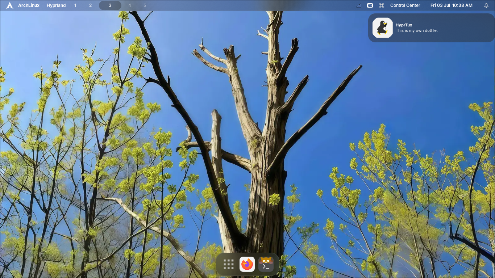
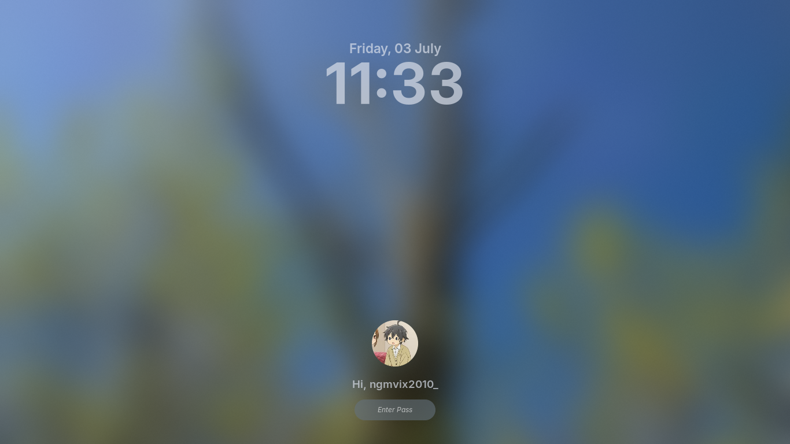
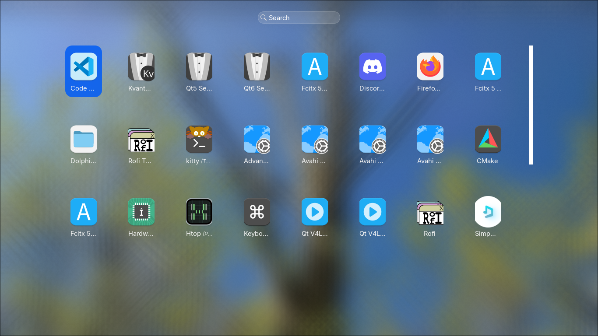
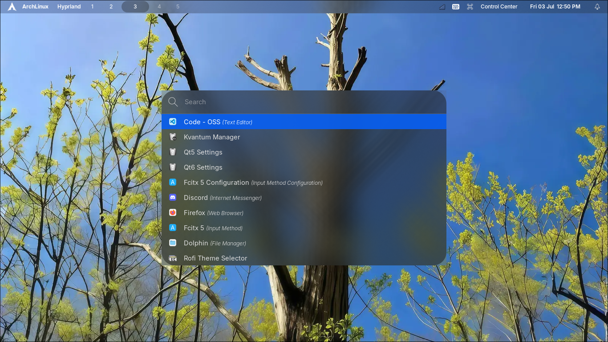

# Pentaxium Shell
This is my own Dotfile for Hyprland, it is focus on a full desktop-like style.
# Screenshot
## Desktop

## Lockscreen

## Launchpad

## Spotlight

## More Screenshot?
### 

# Desktop Compoments
- Menu Bar (Topbar): Waybar
- Dock: eww
- Wallpaper: awww
- Lock Screen: Hyprlock
- Spotlight: Rofi
- Launchpad: Rofi
- Power Menu: Rofi
- Input Method Switcher: Rofi
- Wallpaper Picker: Rofi
- Notification Center & Notification Popup: Swaync
- OSD: SwayOSD
- Control Center: eww
- Desktop Widget: eww
- Date Menu: eww
- Font: Inter
- Terminal: Kitty
- File Manager: Dolphin
- Icon Theme: Colloid
- Cursor Theme: Bibata
# Distro Support
- Arch Linux and its based distro

# Note
This Project is now WIP
